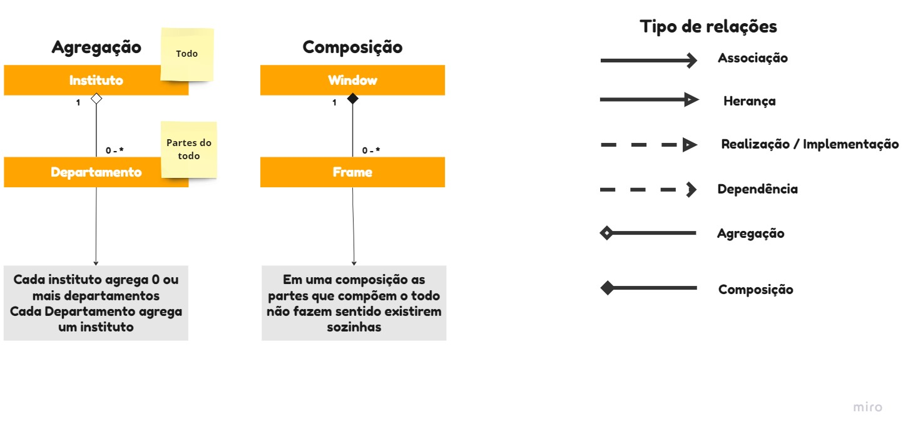
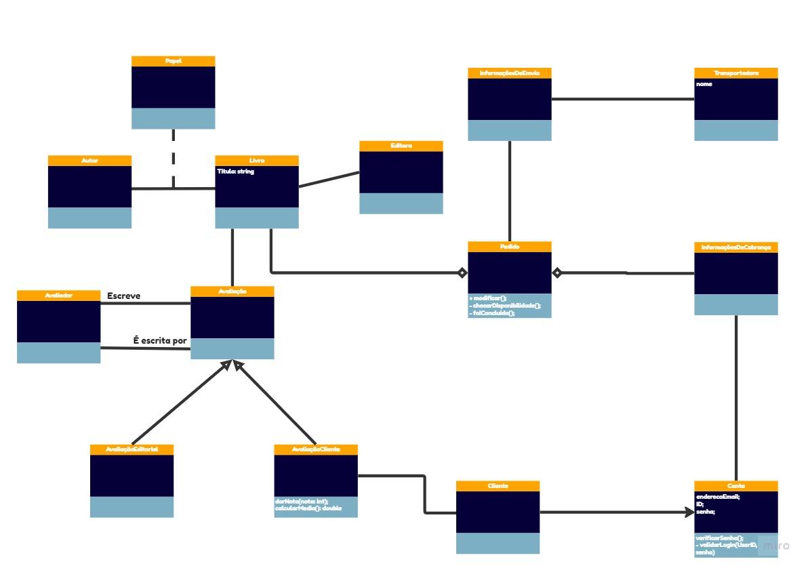

# POO - Programação orientada a objetos
## Mapa Mental
   

## Introdução - UML
   Unified Modeling Language é uma linguagem de notação destinada à modelação e documentação das fases de desenvolvimento de softwares orientados a objetos
   
## Relações - UML
   * **Associação**: Um relacionamento entre dois elementos que mostra que os objetos de um clasificador (Classe, Interface ou Nó) conectam-se e podem navegar em objetos de um outro classificador. Conecta dois classificadores, o principal(Fornecedor) e o secundário (cliente)
   * **Herança**: É uma hierarquia de abstrações na qual uma subclasse herda a estrutura de uma ou mais superclasses
   * **Realização/Implementação**: É uma relacionamento que existe entre dois elementos e se dá quando um deles deve realizar, ou implementar, o comportamento que o outro especifica. O modelo que especifica é o fornecedor e o elemento que implementa é o cliente
   * **Dependência**: Indica que as alteraçõess em um elemento do modelo (fornecedor/independente) podem causar alterações em um outro modelo (cliente/dependente). Obs: O fornecedor não é afetado com mudanças no cliente
   * **Agregação**: Descreve um classificador como uma parte de, ou como um subordinado a outro classificador
   * **Composição**: É um tipo de agregação onde o classificador da parte é dependente da existência do classicador todo
   
## Exemplo de Projeto- UML
   Outros diagramas UML úteis:
   * **Estruturais**
   * Classes
   * Objetos
   * Componentes
   * Implantação
   * **Comportamentais**
   * Sequência
   * Atividades
   * Máquina de Estados
   
## Linguagem Interpretada x Compilada
   * Meados de 1940: surgimento da linguagem de máquina
      * 0100 0011 1010 1111 0000 1010 0001 0011
   * Meados de 1948: surgimento da linguagem de montagem
     * ADD AX, BX
   * Linguagem de alto nível:
      * FORTRAN (1967)
      * LISP (1958)        

## Referências
    - TecnoBlog: https://tecnoblog.net/responde/o-que-e-uml/
    - Coursera: "Laboratório de Programação Orientada a Objetos - Parte 1 (USP)"
    - IBM: https://www.ibm.com/docs/pt-br/rsas/7.5.0?topic=SS4JE2_7.5.5/com.ibm.xtools.modeler.doc/topics/rreltyp.htm
